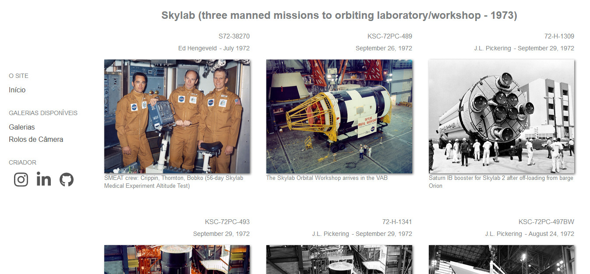

# Apollo Image Gallery

<h2 align="center">
    
</h2>

<h3 align="center">
    <a target="blank" href="https://eduardojm.github.io/apollo-gallery/#/">Acessar Online</a>
</h3>

## :bulb: About

This project was created to get a modern view of the photos from the NASA Apollo program from the page [Apollo Archive](http://www.apolloarchive.com/apollo_gallery.html). This project is developed with **React.JS** and the **styled-components** and is an modern version of a old site created by me.

This load the photos "database" from a scrapper disponible in the repository [apollo-gallery-scrap](https://github.com/EduardoJM/apollo-gallery-scrap), like a false API. The scrap method is not complete automatized for now and need some rewrites.

## :gear: Technologies

- **JavaScript** / **ReactJS**
- **CSS** (com **styled-components**)

## :hammer: Tools

- [Visual Studio Code](https://code.visualstudio.com/download)

## :computer: Running

A version of the project is disponible online, [click here](https://eduardojm.github.io/apollo-gallery/#/), supported by the **github-pages**. But, if you want to run the project locally in your machine, follow the steps:

### Clone the repository

```bash
git clone https://github.com/EduardoJM/apollo-gallery.git
```

### Install the dependencies

```bash
cd apollo-gallery
npm install
```

or

```bash
cd apollo-gallery
yarn
```

### Run the development server

```bash
npm start
```

or 

```bash
yarn start
```

### Build the production

```bash
npm run build
```

or 

```bash
yarn build
```

## :nerd_face: Author

### Eduardo Oliveira

- GitHub: [@EduardoJM](https://github.com/eduardojm/)
- LinkedIn: [/in/edujso](https://www.linkedin.com/in/edujso/)
- Instagram: [@edu.js.o](https://instagram.com/edu.js.o)
